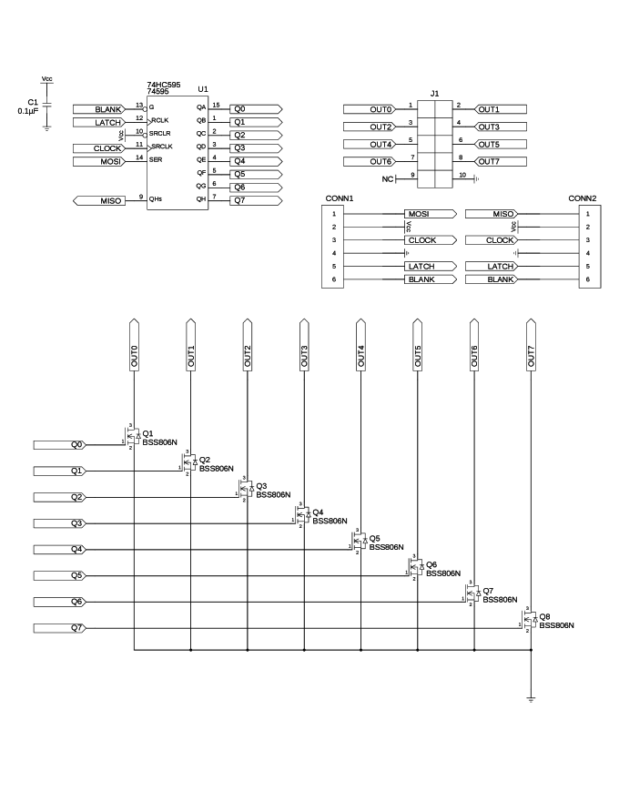
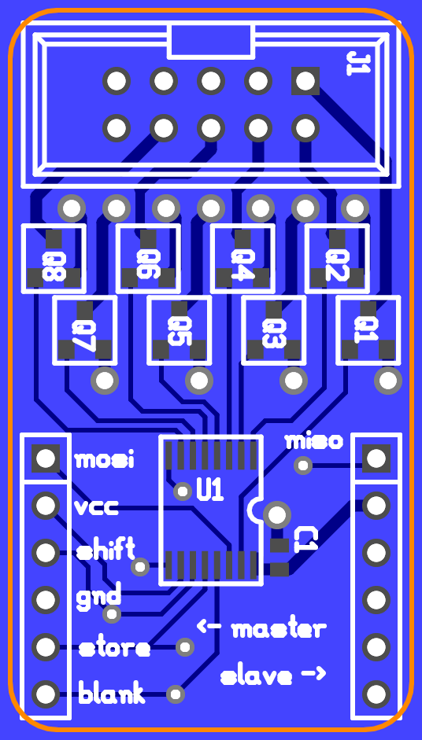
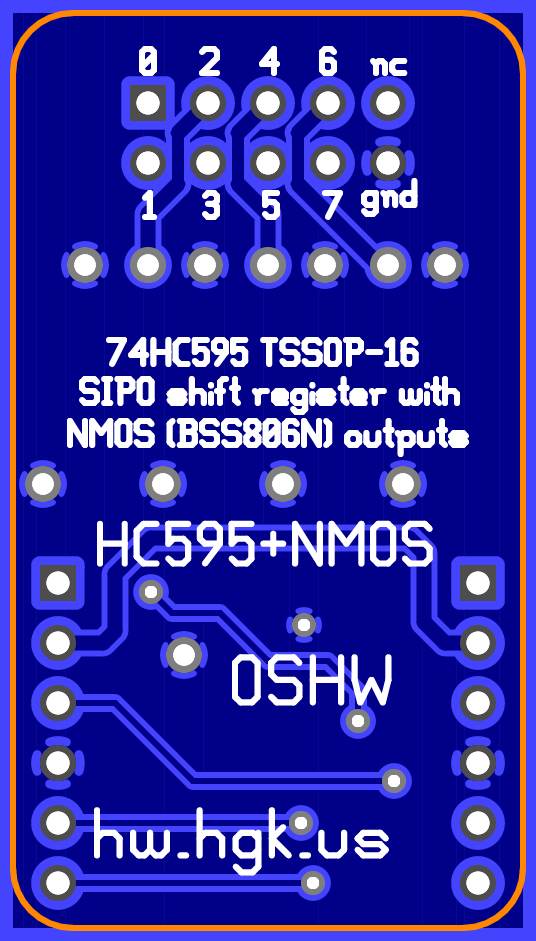

74HC595(PW) SIPO shift register with added N-channel MOSFET outputs
===================================================================

This is a design for an augmented breakout for a 74HC595
serial-in/parallel-out 8-bit shift register, in a TSSOP-16 package
(specifically, 74HC595PW), with added N-channel MOSFETs (BSS806N or
similar) in SOT-23 packages.

Features
--------

*   Decoupling capacitor on board.
*   10-pin boxed header, each providing connections to 8 output pins.
    *   The headers also have an additional ground pin, but do not carry
        Vcc. The intention is for the application circuit to provide its
        own supply voltage, which may be somewhat greater than the logic
        supply.
*   The outputs are not run directly from the 74HC595 pins but via an
    N-channel MOSFET gated by each pin. The outputs are thus sink-only
    but can handle a greater amount of current.
*   The host-side 6-pin header provides power, serial, and blanking
    inputs to the board, while the compatible guest-side 6-pin header
    provides serial outputs and passed-through power and blanking
    outputs to the host-side header of another breakout (or to another
    74HC595-based or similar assembly).
*   Pre-fab and some-assembly-required options for cables for the header
    connectors are readily available.

Parts list
----------

*   1 x 74HC595PW (TSSOP-16)
*   2 x 6-pin header (100-mil centers)
*   1 x 10-pin boxed header (100-mil centers)
*   1 x 0.1µF capacitor (0603)

License
-------

The schematic and layout are to be used under the terms of the "Expat
License" (aka the OSI-approved "MIT license"), wherein the "Software"
refers to these files. The text follows:

> Copyright © 2016 Peter S. May
>
> Permission is hereby granted, free of charge, to any person obtaining
> a copy of this software and associated documentation files (the
> "Software"), to deal in the Software without restriction, including
> without limitation the rights to use, copy, modify, merge, publish,
> distribute, sublicense, and/or sell copies of the Software, and to
> permit persons to whom the Software is furnished to do so, subject to
> the following conditions:
>
> The above copyright notice and this permission notice shall be
> included in all copies or substantial portions of the Software.
>
> THE SOFTWARE IS PROVIDED "AS IS", WITHOUT WARRANTY OF ANY KIND,
> EXPRESS OR IMPLIED, INCLUDING BUT NOT LIMITED TO THE WARRANTIES OF
> MERCHANTABILITY, FITNESS FOR A PARTICULAR PURPOSE AND NONINFRINGEMENT.
> IN NO EVENT SHALL THE AUTHORS OR COPYRIGHT HOLDERS BE LIABLE FOR ANY
> CLAIM, DAMAGES OR OTHER LIABILITY, WHETHER IN AN ACTION OF CONTRACT,
> TORT OR OTHERWISE, ARISING FROM, OUT OF OR IN CONNECTION WITH THE
> SOFTWARE OR THE USE OR OTHER DEALINGS IN THE SOFTWARE.
